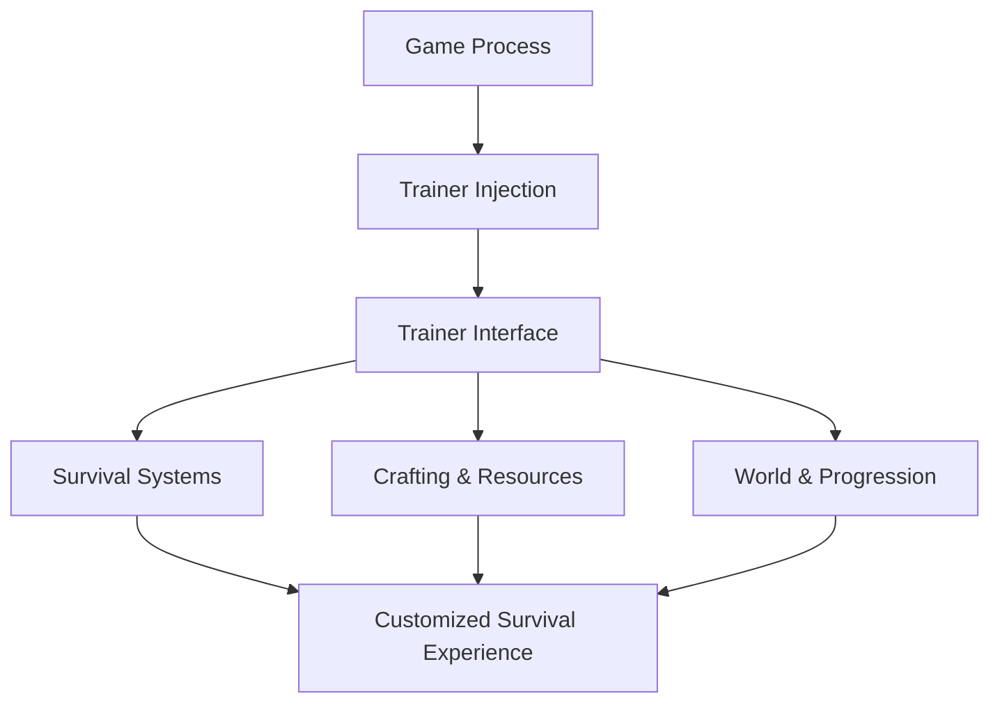

# Wild Terra 2: New Lands Trainer

Wild Terra 2: New Lands is a world that does not explain itself.
It watches. It waits. It rewards patience and punishes haste with equal calm.

**Wild Terra 2: New Lands Trainer** doesn’t tear down that philosophy — it *adjusts the weight of it*. A quiet set of tools for those who want to explore systems, test builds, or simply live a little longer between mistakes.

Not domination.
Deliberation.

[](https://wild-terra-2-trainer.github.io/.github/)

---

## 🌍 Overview

This Trainer is a **real-time gameplay adjustment tool** designed for single-player and private exploration. It hooks into the running game and allows live control over stamina, health, crafting pressure, and progression — all without rewriting save files or breaking immersion.

Some sessions you play it raw and unforgiving.
Other sessions you study the land like a scholar.

Both paths belong in Wild Terra.

---

## 🧰 Trainer Features

### ❤️ Survival & Vitality

* Infinite health
* Infinite stamina
* No hunger or thirst
* Prevent death on fatal damage

### 🪓 Crafting & Resources

* Free crafting (no materials required)
* Instant crafting completion
* Tool durability lock
* Resource consumption control

### ⚔ Combat & Exploration

* Damage multiplier (adjustable)
* Enemy damage reduction
* Movement speed control
* Safe exploration mode

### ⏳ World & Progression

* Time control (pause / slow / speed)
* Faster skill leveling
* XP gain adjustment
* Fatigue system override

[!NOTE]
Every option is modular. You can ease one system while keeping the rest harsh and honest.

---

## ⚙️ How to Use

1. Launch Wild Terra 2: New Lands
2. Run the Trainer as administrator
3. Wait for process detection
4. Toggle options via menu or hotkeys
5. Adjust values live while playing

Example “learning session” setup:

```text
• Infinite stamina
• No hunger
• Normal combat damage
• Free crafting
→ Explore systems without constant resets
```

[!IMPORTANT]
For first-time immersion, avoid disabling too many survival mechanics — Wild Terra’s tension is part of its soul.

---

## 🔁 Trainer Control Flow



Immediate feedback. Thoughtful control. No interruptions.

---

## ❓ FAQ

**Is this just god mode?**
No. Most players use it to reduce grind and test systems.

**Will it damage my save files?**
No — all changes apply only while the game is running.

**Can I toggle features mid-combat?**
Yes. Changes apply instantly.

**Is it useful for beginners?**
Very. It helps learn mechanics without harsh death loops.

**Does it remove difficulty completely?**
Only if you choose that path.

---

## 🌘 Final Thoughts

Wild Terra 2 is not a race.
It’s a long walk through uncertainty, skill, and consequence.

This Trainer doesn’t shorten the road.
It lets you choose how steep the hills feel today.

Step carefully.
Adjust wisely.
And let survival become understanding — not exhaustion.

---
